# Quality Improvement Charts

------------------------------------------------------------------------

The `qicharts2` package contains two main functions for analysis and
visualisation of data for continuous quality improvement:
[`qic()`](../reference/qic.md) and
[`paretochart()`](../reference/paretochart.md).

[`qic()`](../reference/qic.md) provides a simple interface for
constructing statistical process control (SPC) charts for time series
data.


[`paretochart()`](../reference/paretochart.md) constructs Pareto charts
from categorical variables.

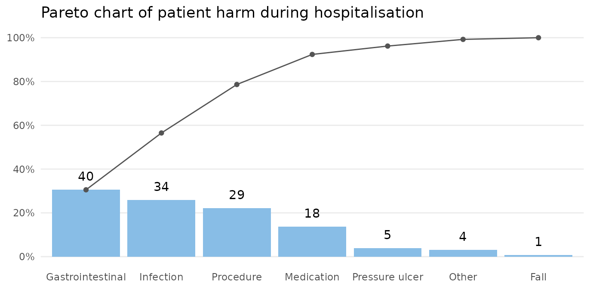

> Statistical Process Control is not about statistics, it is not about
> “process-hyphen-control”, and it is not about conformance to
> specifications. \[…\] It is about the continual improvement of
> processes and outcomes. And it is, first and foremost, *a way of
> thinking* with some tools attached.
>
> Donald J. Wheeler. Understanding Variation, 2. ed., p 152

This vignette will teach you the easy part of SPC, *the tools*, as
implemented by `qicharts2` for R. I strongly recommend that you also
study *the way of thinking*, for example by reading Wheeler’s excellent
book.

## Installation

Install stable version from CRAN:

``` r
install.packages('qicharts2')
```

Or install development version from GitHub:

``` r
devtools::install_github('anhoej/qicharts2', build_vignettes = TRUE)
```

## Your first run and control charts

Load `qicharts2` and generate some random numbers to play with:

``` r
# Load qicharts2
library(qicharts2)

# Lock random number generator to make examples reproducible.
set.seed(19)

# Generate 24 random numbers from a normal distribution.
y <- rnorm(24)
```

Make a run chart:

``` r
qic(y)
```


Make an I control chart:

``` r
qic(y, chart = 'i')
```


Run charts and control charts are point-and-line graphs showing measures
or counts over time. A horizontal line represents the process centre
expressed by either the median (run charts) or the mean (control
charts). In addition, control charts visualise the limits of the natural
variation inherent in the process. Because of the way these limits are
computed, they are often referred to as 3-sigma limits (see Appendix 1).
Other terms for 3-sigma limits are control limits and natural process
limits.

## Understanding variation

SPC is the application of statistical thinking and statistical tools to
continuous quality improvement. Central to SPC is the understanding of
process variation over time.

The purpose of analysing process data is to know when a change occurs so
that we can take appropriate action. However, numbers may change even if
the process stays the same (and vice versa). So how do we distinguish
changes in numbers that represent change of the underlying process from
those that are essentially noise?

[Walther A. Shewhart](https://en.wikipedia.org/wiki/Walter_A._Shewhart),
who founded SPC, described two types of variation, *chance cause
variation* and *assignable cause variation*. Today, the terms *common
cause* and *special cause* variation are commonly used.

**Common cause variation**

- is also called natural/random variation or noise,

- is present in all processes,

- is caused by phenomena that are always present within the system,

- makes the process predictable within limits.

**Special cause variation**

- is also called non-random variation or signal,

- is present in some processes,

- is caused by phenomena that are not normally present in the system,

- makes the process unpredictable.

> A process will be said to be predictable when, through the use of past
> experience, we can describe, at least within limits, how the process
> will behave in the future.
>
> Donald J. Wheeler. Understanding Variation, 2. ed., p 153

The overall purpose of SPC charts is to tell the two types of variation
apart.

## Testing for special cause variation

As expected from random numbers, the previous run and control charts
exhibit common cause variation. Special cause variation, if present, may
be found by statistical tests to identify patterns in data that are
unlikely to be the result of pure chance.

### Shewhart’s 3-sigma rule

Shewhart devised one test to identify special cause variation, the
3-sigma rule, which signals if one or more data points fall outside the
3-sigma limits. The 3-sigma rule is effective in detecting larger (\>
2SD) shifts in data.

``` r
# Simulate a special cause to y in the form of a large, transient shift of 4 standard deviations.
y[22] <- 4

qic(y, chart = 'i')
```


However, minor to moderate shifts may go unnoticed by the 3-sigma rule
for long periods of time.

``` r
# Simulate a special cause to y in the form of a moderate, persistent shift of 2 standard deviations.
y[13:24] <- rnorm(12, mean = 2)

qic(y, chart = 'i')
```

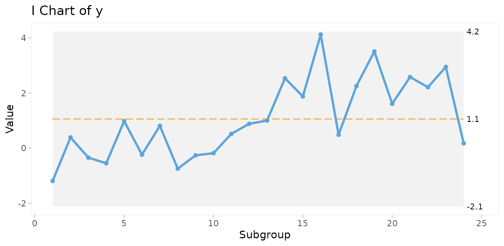

Therefore, many additional tests have been proposed to increase the
sensitivity to non-random variation.

It is important to realise that while it may be tempting to apply more
tests in order to increase the sensitivity of the chart, more test will
increase the risk of false signals, thereby reducing the specificity of
the chart. The choice of which and how many tests to apply is therefore
critical.

### The Western Electric rules

The best known tests for non-random variation are probably the [Western
Electric Rules](https://en.wikipedia.org/wiki/Western_Electric_rules)
described in the Statistical Quality Control Handbook (Western Electric
Company 1956). The WE rules consist of four simple tests that can be
applied to control charts by visual inspection and are based on the
identification of unusual patterns in the distribution of data points
relative to the control and centre lines.

1.  One or more points outside of the 3-sigma limits (Shewhart’s
    original 3-sigma rule).

2.  Two out of three successive points beyond a 2-sigma limit (two
    thirds of the distance between the centre line and the control
    line).

3.  Four out of five successive points beyond a 1-sigma limit.

4.  A run of eight successive points on one side of the centre line.

The WE rules have proven their worth during half a century. One thing to
notice is that the WE rules are most effective with control charts that
have between 20 and 30 data points. With fewer data points, they lose
sensitivity (more false negatives), and with more data points they lose
specificity (more false positives).

### The Anhøj rules

The least known tests for non-random variation are probably the Anhøj
rules, proposed and validated by me in two recent publications ([Anhøj
2014](https://doi.org/10.1371/journal.pone.0113825), [Anhøj
2015](https://doi.org/10.1371/journal.pone.0121349)). The Anhøj rules
are the core of `qicharts2`, and consist of two tests that are based
solely on the distribution of data points in relation to the centre
line:

- **Unusually long runs**: A run is one or more consecutive data points
  on the same side of the centre line. Data points that fall on the
  centre line neither break nor contribute to the run. The upper 95%
  prediction limit for longest run is approximately $log_{2}(n) + 3$
  (rounded to the nearest integer), where $n$ is the number of useful
  data points. For example, in a run chart with 24 data points a run of
  *more* than `round(log2(24) + 3)` = 8 would suggest a shift in the
  process.

- **Unusually few crossings**: A crossing is when two consecutive data
  points are on opposite sides of the centre line. In a random process,
  the number of crossings has a binomial distribution, $b(n - 1,0.5)$.
  The lower 5% prediction limit for number of crossings is found using
  `qbinom(p = 0.05, size = n - 1, prob = 0.5)`. Thus, in a run chart
  with 24 useful data points, *fewer* than `qbinom(0.05, 24 - 1, 0.5)` =
  8 crossings would suggest that the process is shifting.

Critical values for longest runs and number of crossings for 10 – 100
data points are tabulated in Appendix 2.

Apart from being comparable in sensitivity and specificity to WE rules
2-4 with 20-30 data points, the Anhøj rules have some advantages:

- They do not depend on sigma limits and thus are useful as stand-alone
  rules with run charts.

- They adapt dynamically to the number of available data points, and can
  be applied to charts with as few as 10 and up to indefinitely many
  data points without losing sensitivity and specificity.

In the previous control chart, a shift of 2 standard deviations was
introduced halfway through the process. While the shift is too small to
be picked up by the 3-sigma rule, both Anhøj rules detect the signal.
The longest run includes 13 data points (upper limit = 8), and the
number of crossings is 4 (lower limit = 8). Note that the shift is also
picked up by WE rule 4.

Non-random variation found by the Anhøj rules is visualised by
[`qic()`](../reference/qic.md) using a red and dashed centre line.

The parameters of the analysis are available using the
[`summary()`](https://rdrr.io/r/base/summary.html) function on a qic
object. See [`?summary.qic`](../reference/summary.qic.md) for details.

``` r
# Save qic object to o
o <- qic(y, chart = 'i')

# Print summary data frame
summary(o)
#>   facet1 facet2 part n.obs n.useful longest.run longest.run.max n.crossings
#> 1      1      1    1    24       24          13               8           4
#>   n.crossings.min runs.signal      aLCL   aLCL.95       CL  aUCL.95     aUCL
#> 1               8           1 -2.114884 -1.057559 1.057091 3.171742 4.229067
#>   sigma.signal
#> 1            0
```

Many additional tests for special cause variation have been proposed
since Shewhart invented the 3-sigma rule, and many tests are currently
being used. However, the more tests that are applied to the analysis,
the higher the risk of false signals. `qicharts2` takes a conservative
approach by applying only three tests, the 3-sigma rule and the two
Anhøj rules. That means that a signal from
[`qic()`](../reference/qic.md) most likely represents a significant
change in the underlying process.

## Choosing the right control chart

By default, [`qic()`](../reference/qic.md) produces run charts. To make
a control chart, the `chart` argument must be specified.

While there is only one type of run chart, there are many types of
control charts. Each type uses an assumed probability model to compute
the 3-sigma limits.

[`qic()`](../reference/qic.md) includes eleven control charts.

| Chart                 | Description                                             | Assumed distribution |
|-----------------------|---------------------------------------------------------|----------------------|
| *Charts for measures* |                                                         |                      |
| I                     | Individual measurements                                 | Gaussian             |
| MR                    | Moving ranges of individual measurements                | Gaussian             |
| Xbar                  | Sample means                                            | Gaussian             |
| S                     | Sample standard deviations                              | Gaussian             |
| T                     | Time between rare events                                | Exponential          |
| *Charts for counts*   |                                                         |                      |
| C                     | Defect counts                                           | Poisson              |
| U                     | Defect rates                                            | Poisson              |
| U’                    | U chart using Laney’s correction for large sample sizes | Mixed                |
| P                     | Proportion of defectives                                | Binomial             |
| P’                    | P chart using Laney’s correction for large sample sizes | Mixed                |
| G                     | Opportunities between rare events                       | Geometric            |

I recommend to always begin any analysis with the “assumption free” run
chart. If the Anhøj rules find non-random variation, it makes no sense
to compute 3-sigma limits based on assumptions regarding the location
and dispersion of data, because these figures are meaningless when one
or more shifts have already been identified.

> Over the years, I have developed an increasing affection for the
> much-neglected run chart: a time plot of your process data with the
> median drawn in as a reference (yes, the median – not the average). It
> is “filter No. 1” for any process data and answers the question: “Did
> this process have at least one shift during this time period?” (This
> is generally signaled by a clump of eight consecutive data points
> either all above or below the median.)
>
> If it did, then it makes no sense to do a control chart at this time
> because the overall average of all these data doesn’t exist. (Sort of
> like: If I put my right foot in a bucket of boiling water and my left
> foot in a bucket of ice water, on average, I’m pretty comfortable.)
>
> Davis Balestracci. [Quality Digest
> 2014](https://www.qualitydigest.com/inside/six-sigma-column/control-charts-simple-elegance-or-legalized-torture-010614.html)

## Case 1: Patient harm

The `gtt` dataset contains data on patient harm during hospitalisation.
Harm is defined as any unintended physical injury resulting from
treatment or care during hospitalisation and not a result of the disease
itself. The Global Trigger Tool is a methodology for detection of
adverse events in hospital patients using a retrospective record review
approach. Each month a random sample of 20 patient records is reviewed
and the number of adverse events and patient days found in the sample
are counted. See [`?gtt`](../reference/gtt.md) for details.

``` r
head(gtt)
#>   admission_id admission_dte discharge_dte      month days harms              E
#> 1            1    2010-01-02    2010-01-03 2010-01-01    2     0           <NA>
#> 2            2    2009-12-24    2010-01-06 2010-01-01   14     2 Pressure ulcer
#> 3            3    2009-12-28    2010-01-07 2010-01-01   11     0           <NA>
#> 4            4    2010-01-05    2010-01-08 2010-01-01    4     0           <NA>
#> 5            5    2010-01-05    2010-01-08 2010-01-01    4     0           <NA>
#> 6            6    2010-01-05    2010-01-11 2010-01-01    7     0           <NA>
#>                  F    G    H    I
#> 1             <NA> <NA> <NA> <NA>
#> 2 Gastrointestinal <NA> <NA> <NA>
#> 3             <NA> <NA> <NA> <NA>
#> 4             <NA> <NA> <NA> <NA>
#> 5             <NA> <NA> <NA> <NA>
#> 6             <NA> <NA> <NA> <NA>
```

### Run chart of adverse events per 1000 patient days

``` r
qic(month, harms, days,
    data     = gtt,
    multiply = 1000,
    title    = 'Patient harm',
    ylab     = 'Adverse events per 1000 patient days',
    xlab     = 'Month')
```


Since only random variation is present in the run chart, a U control
chart for harm rate is appropriate for computing the limits of the
common cause variation.

### U chart of adverse events per 1000 patient days

``` r
qic(month, harms, days,
    data     = gtt,
    chart    = 'u',
    multiply = 1000,
    title    = 'Patient harm (U chart)',
    ylab     = 'Adverse events per 1000 patient days',
    xlab     = 'Month')
```


Because the sample sizes (number of patient days) are not the same each
month, the 3-sigma limits vary. Large samples give narrow limits and
vice versa. Varying limits are also seen in P and Xbar charts.

### Run and P control charts of percent harmed patients

To plot the percentage of harmed patients (patients with 1 or more
harms) we need to add a variable and to aggregate data by month.

``` r
suppressPackageStartupMessages(library(dplyr))

gtt_by_month <- gtt %>%
  mutate(harmed = harms > 0) %>% 
  group_by(month) %>% 
  summarise(harms    = sum(harms),
            days     = sum(days),
            n.harmed = sum(harmed),
            n        = n())

head(gtt_by_month)
#> # A tibble: 6 × 5
#>   month      harms  days n.harmed     n
#>   <date>     <dbl> <dbl>    <int> <int>
#> 1 2010-01-01     5   113        3    20
#> 2 2010-02-01     7   132        6    20
#> 3 2010-03-01     5   121        4    20
#> 4 2010-04-01     7   134        5    20
#> 5 2010-05-01     7   116        7    20
#> 6 2010-06-01     5   131        5    20
```

``` r
qic(month, n.harmed,
    n         = n,
    data      = gtt_by_month,
    y.percent = TRUE,
    title     = 'Harmed patients',
    ylab      = NULL,
    xlab      = 'Month')
```

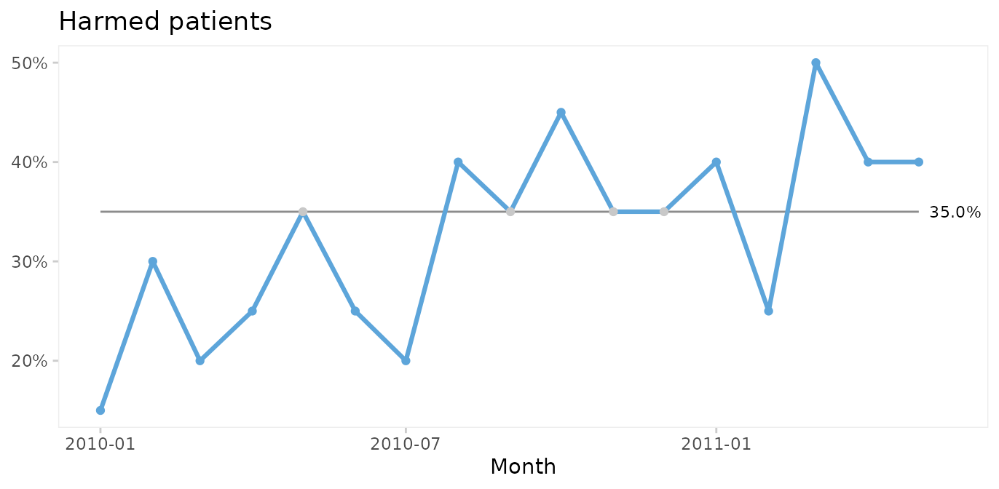

Again, since the run chart finds random variation, a control chart may
be applied. For proportion (or percent) harmed patients we use a P
chart.

``` r
qic(month, n.harmed, n,
    data      = gtt_by_month,
    chart     = 'p',
    y.percent = TRUE,
    title     = 'Harmed patients (P chart)',
    ylab      = NULL,
    xlab      = 'Month')
```

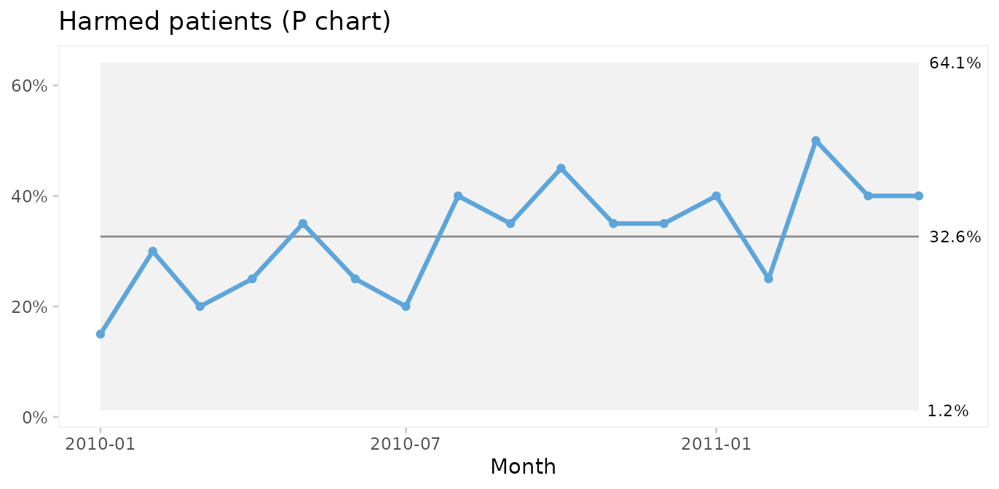

Since both the harm rate and the proportion of harmed patients exhibit
common cause variation only, we conclude that the risk of adverse events
during hospitalisation is predictable: we in the future should expect
around 60 adverse events per 1000 patient days, harming around 33% of
patients (regardless of their length of stay), although harm rates
anywhere between ~0 – 60% would be considered within common cause
variation.

Actually, we often do not need to aggregate data in advance. With a
little creativity we can make `qic` do the hard work. The previous plot
could have been produced with this code. Note the use of the original
`gtt` dataset and the number of harmed and total number of patients
created on the fly.

``` r
qic(month, 
    harms > 0,        # TRUE if patient had one or more harms
    days > 0,         # Always TRUE 
    data      = gtt,
    chart     = 'p',
    y.percent = TRUE,
    title     = 'Harmed patients (P chart)',
    ylab      = NULL,
    xlab      = 'Month')
```

### Pareto analysis of adverse event types and severity

The Pareto chart, named after [Vilfred
Pareto](https://en.wikipedia.org/wiki/Vilfredo_Pareto), was invented by
[Joseph M. Juran](https://en.wikipedia.org/wiki/Joseph_M._Juran) as a
tool to identify the most important causes of a problem.

Types and severity of adverse events in `gtt` are organised in an untidy
wide format. Since [`paretochart()`](../reference/paretochart.md) needs
a vector of categorical data, we need to rearrange harm severity and
harm category into separate columns.

``` r
suppressPackageStartupMessages(library(tidyr))

gtt_ae_types <- gtt %>%
  gather(severity, category, E:I) %>% 
  filter(complete.cases(.))

head(gtt_ae_types)
#>   admission_id admission_dte discharge_dte      month days harms severity
#> 1            2    2009-12-24    2010-01-06 2010-01-01   14     2        E
#> 2           11    2010-01-08    2010-01-18 2010-01-01   11     2        E
#> 3           12    2010-01-11    2010-01-19 2010-01-01    9     1        E
#> 4           29    2010-01-27    2010-02-10 2010-02-01   15     1        E
#> 5           41    2010-02-24    2010-03-01 2010-03-01    6     1        E
#> 6           45    2010-02-22    2010-03-06 2010-03-01   13     1        E
#>           category
#> 1   Pressure ulcer
#> 2        Infection
#> 3   Pressure ulcer
#> 4   Pressure ulcer
#> 5 Gastrointestinal
#> 6 Gastrointestinal
```

``` r
paretochart(gtt_ae_types$category,
            title = 'Pareto chart of harm category')
```

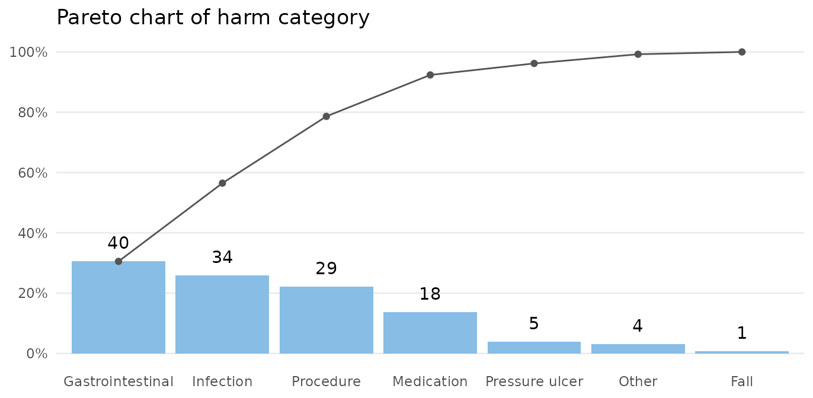

The bars show the number in each category, and the curve shows the
cumulated percentage over categories. Almost 80% of harms come from 3
categories: gastrointestinal, infection, and procedure.

``` r
paretochart(gtt_ae_types$severity,
            title = 'Pareto chart of harm severity')
```


Almost all harms are temporary (E-F).

## Case 2: *Clostridium difficile* infections

The `cdi` dataset contains data on hospital acquired *Clostridium
difficile* infections (CDI) before and after an intervention to reduce
the risk of CDI. See [`?cdi`](../reference/cdi.md) for details.

``` r
head(cdi)
#>        month  n     days period notes
#> 1 2012-11-01 17 14768.42    pre  <NA>
#> 2 2012-12-01 12 14460.33    pre  <NA>
#> 3 2013-01-01 27 16176.92    pre  <NA>
#> 4 2013-02-01 20 14226.50    pre  <NA>
#> 5 2013-03-01 20 14816.25    pre  <NA>
#> 6 2013-04-01 18 14335.29    pre  <NA>
```

### Run charts for number of infections

We begin by plotting a run chart of the number of CDIs per month.

``` r
qic(month, n,
    notes    = notes,
    data     = cdi,
    decimals = 0,
    title    = 'Hospital acquired Clostridium difficile infections',
    ylab     = 'Count',
    xlab     = 'Month')
```


A downward shift in the number of CDIs is clearly visible to the naked
eye and is supported by the runs analysis resulting in the centre line
being dashed red. The shift seem to begin around the time of the
intervention.

Even though it is not necessary in this case, we can strengthen the
analysis by using the median of the before-intervention period to test
for non-random variation in the after period.

``` r
qic(month, n,
    data        = cdi,
    decimals    = 0,
    freeze      = 24,
    part.labels = c('Baseline', 'Intervention'),
    title       = 'Hospital acquired Clostridium difficile infections',
    ylab        = 'Count',
    xlab        = 'Month')
```


The median number of CDIs per month in the before period is 19. An
unusually long run of 15 data points below the median proves that the
CDI rate is reduced.

When a shift in the desired direction is the result of a deliberate
change to the process, we may split the chart to compare the numbers
before and after the intervention.

``` r
qic(month, n,
    data     = cdi,
    decimals = 0,
    part     = 24,
    title    = 'Hospital acquired Clostridium difficile infections',
    ylab     = 'Count',
    xlab     = 'Month')
```

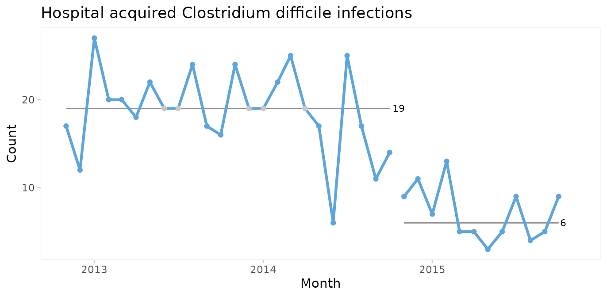

### C chart for number of infections

Since both periods show only random variation, a control chart may be
applied to test for larger transient shifts in data and to establish the
natural limits of the current process. The correct chart in this case is
the C chart for number of infections.

``` r
qic(month, n,
    data  = cdi,
    chart = 'c',
    part  = 24,
    title = 'Hospital acquired Clostridium difficile infections (C chart)',
    ylab  = 'Count',
    xlab  = 'Month')
```

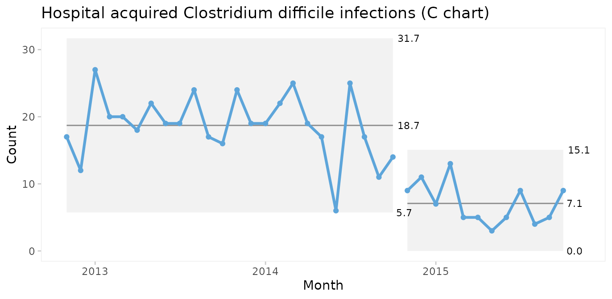

The split C chart shows that the CDI rate has dropped from an average of
19 to 7 per month. Furthermore, the 3-sigma limits tell that the current
process is predictable and that we in the future should expect between 0
and 15 CDIs per month.

### U chart for infection rate

Until now we have assumed that the area of opportunity, or exposure, is
constant, i.e., the number of patients or patient days have not changed
significantly over time. When the area of opportunity varies, a U chart
(U for *unequal* area of opportunity) is more appropriate.

``` r
qic(month, n, days,
    data     = cdi,
    chart    = 'u',
    part     = 24,
    multiply = 10000, 
    title    = 'Hospital acquired Clostridium difficile infections (U chart)',
    ylab     = 'Cases per 10,000 risk days',
    xlab     = 'Month')
```


In fact, U charts can always be used instead of C charts. When the area
of opportunity is constant the two charts will reach the same
conclusion. But the raw numbers in a C chart may be easier to
communicate than counts per something.

It is very important to recognise that while run and control charts can
identify non-random variation, they cannot identify its causes. The
analysis only tells that the CDI rate was reduced after an intervention.
The causal relationship between the intervention and the shift must be
established using other methods.

### When should you recompute the limits?

When splitting a chart as in the example above you make a deliberate
decision based on your understanding of the process. Some software
packages offer automated recalculation of limits whenever a shift is
detected. I find this approach very wrong. Limits are the voice of the
process and recomputing limits without understanding the context, which
computers don’t, is like telling someone to shut up, when they are
really trying to tell you something important.

Wheeler suggests that limits *may* be recomputed when the answers to all
four of these question is “yes” (Wheeler 2010, p. 224):

- Do the data display a distinctly different kind of behaviour than in
  the past?

- Is the reason for this change in behaviour known?

- Is the new process behaviour desirable?

- Is it intended and expected that the new behaviour will continue?

If the answer to any of these question is “no”, you should rather seek
to find the assignable cause of the shift and, if need be, eliminate it.

Thus, when a deliberate change has been made to the process and the
chart finds a shift attributable to this change, it may be time to
recompute the limits.

## Case 3: Coronary artery bypass graft

The `cabg` dataset contains data on individual coronary artery bypass
operations. See [`?cabg`](../reference/cabg.md) for details.

``` r
head(cabg)
#>         date    age gender los death readmission
#> 1 2011-07-01 72.534   Male   8 FALSE        TRUE
#> 2 2011-07-01 59.225   Male   9 FALSE       FALSE
#> 3 2011-07-04 66.841   Male  15 FALSE       FALSE
#> 4 2011-07-04 70.337   Male   9 FALSE       FALSE
#> 5 2011-07-04 60.816   Male   6 FALSE        TRUE
#> 6 2011-07-05 57.027   Male   9 FALSE       FALSE
```

### I and MR charts for age of individual patients

In this and the following cases we skip the obligatory first step of
using a run chart.

First, we will make a control chart of the age of the last 100 patients.
Since we are plotting individual measurements, we use an I chart.

``` r
qic(age,
    data      = tail(cabg, 100), 
    chart     = 'i',
    show.grid = TRUE,
    title     = 'Age of the last 100 patients (I chart)',
    ylab      = 'Years',
    xlab      = 'Patient #')
```


Two data points (patients number 45 and 70) are below the lower 3-sigma
limit indicating that these patients are “unusually” young,
i.e. representative of phenomena that are not normally present in the
process.

I charts are often displayed along moving range charts that show the
ranges of neighbouring data points.

``` r
qic(age,
    data      = tail(cabg, 100), 
    chart     = 'mr',
    show.grid = TRUE,
    title     = 'Age of the last 100 patients (MR chart)',
    ylab      = 'Years',
    xlab      = 'Patient #')
```

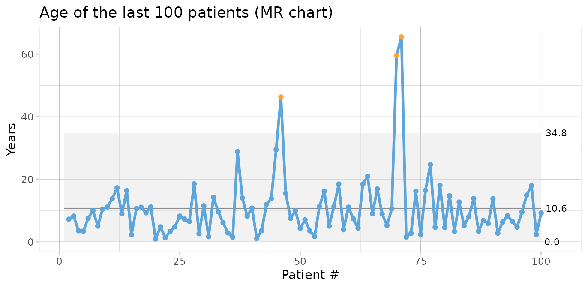

The MR chart identifies three unusually large ranges, which are clearly
produced by the two unusually young patients also found in the I chart.
Note that each data point in an I chart is contained in two moving
ranges in the MR chart.

We should seek the cause(s) of these special causes. We may then chose
to eliminate the outliers from the computations of the process centre
and 3-sigma limits in order to predict the expected age range of future
patients.

``` r
qic(age,
    data    = tail(cabg, 100), 
    chart   = 'i',
    exclude = c(45, 70),
    title   = 'Age of the last 100 patients (I chart)',
    ylab    = 'Years',
    xlab    = 'Patient #')
```

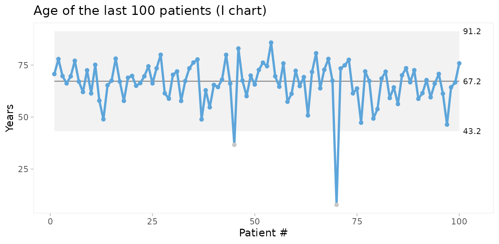

Thus, on average we should expect future patients to be 67 years of age,
and patients younger than 43 years or older than 91 years would be
unusual.

### Xbar and S charts for average and standard deviation of patient age

We could also plot the mean age of patients by month. For this we choose
an Xbar chart for multiple measurement per subgroup. First, we need to
add month as the grouping variable.

``` r
cabg <- cabg %>% 
  mutate(month = as.Date(cut(date, 'month')))
```

Using month as the x axis variable, [`qic()`](../reference/qic.md)
automatically calculates the average age per month.

``` r
qic(month, age,
    data  = cabg,
    chart = 'xbar',
    title = 'Average age (Xbar chart)',
    ylab  = 'Years',
    xlab  = 'Month')
```


Xbar charts are usually displayed along S charts displaying the within
subgroup standard deviation.

``` r
qic(month, age,
    data  = cabg,
    chart = 's',
    title = 'Age standard deviation (S chart)',
    ylab  = 'Years',
    xlab  = 'Month')
```


Since both the Xbar and the S chart display common cause variation, we
may conclude that the monthly average and standard deviation of patient
age is predictable. Note that the mean of the Xbar chart is close to the
mean of the individuals chart but that the 3-sigma limits are narrower.

### P charts for proportion of patients who were readmitted or died within 30 after surgery

To plot readmissions and mortality we first need to summarise these
counts by month.

``` r
cabg_by_month <- cabg %>% 
  group_by(month) %>% 
  summarise(deaths       = sum(death),
            readmissions = sum(readmission),
            n            = n())

head(cabg_by_month)
#> # A tibble: 6 × 4
#>   month      deaths readmissions     n
#>   <date>      <int>        <int> <int>
#> 1 2011-07-01      1           14    52
#> 2 2011-08-01      3           12    64
#> 3 2011-09-01      2           15    70
#> 4 2011-10-01      1            8    60
#> 5 2011-11-01      1           16    67
#> 6 2011-12-01      3           11    69
```

Then we use P charts for proportion of readmissions.

``` r
qic(month, readmissions, n,
    data      = cabg_by_month,
    chart     = 'p',
    y.percent = TRUE,
    title     = 'Readmissions within 30 days (P chart)',
    ylab      = NULL,
    xlab      = 'Month')
```

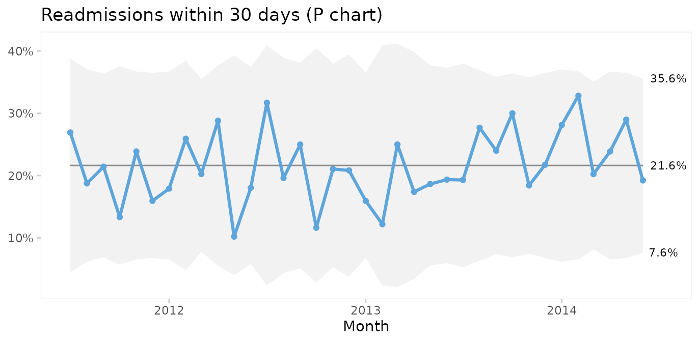

On average, 22% of patients are readmitted within 30 days after surgery,
and if nothing changes we would expect this to continue.

What about mortality?

``` r
qic(month, deaths, n,
    data      = cabg_by_month,
    chart     = 'p',
    y.percent = TRUE,
    title     = '30 days mortality (P chart)',
    ylab      = NULL,
    xlab      = 'Month')
```


Thankfully, post-surgery mortality is a rare event, and the P chart
suggests common cause variation. However, it seems curious that only one
patient died during the summer of 2012. To investigate this further, G
or T charts for rare events are useful.

### T and G charts for rare events

Rare events are often better analysed as time or opportunities between
events. First, we need to calculate the number of surgeries and days
between fatalities.

``` r
fatalities <- cabg %>% 
  mutate(x = row_number()) %>% 
  filter(death) %>% 
  mutate(dd = x - lag(x),
         dt = date - lag(date))

head(fatalities)
#>         date    age gender los death readmission      month   x dd      dt
#> 1 2011-07-21 91.227 Female   5  TRUE       FALSE 2011-07-01  37 NA NA days
#> 2 2011-08-06 71.773   Male   2  TRUE       FALSE 2011-08-01  60 23 16 days
#> 3 2011-08-26 73.942   Male   1  TRUE       FALSE 2011-08-01  99 39 20 days
#> 4 2011-08-31 80.293   Male   3  TRUE       FALSE 2011-08-01 114 15  5 days
#> 5 2011-09-13 75.359   Male  12  TRUE       FALSE 2011-09-01 148 34 13 days
#> 6 2011-09-14 72.019 Female  19  TRUE       FALSE 2011-09-01 149  1  1 days
```

Then we use a G chart for opportunities (surgeries) between events
(deaths).

``` r
qic(dd,
    data  = fatalities,
    chart = 'g',
    title = 'Surgeries between deaths (G chart)',
    ylab  = 'Count',
    xlab  = 'Death #')
```

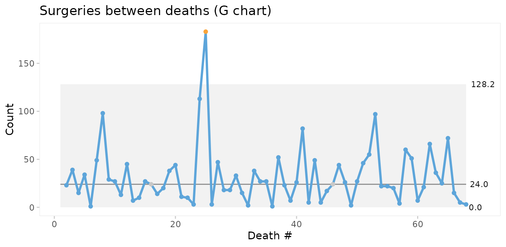

If we do not have information on the opportunities (surgeries with
survival), we may instead use a T chart for time between events.

``` r
qic(dt,
    data  = fatalities,
    chart = 't',
    title = 'Days between deaths (T chart)',
    ylab  = 'Days',
    xlab  = 'Death #')
```


The conclusions from the two charts are the same: Deaths number 24 and
25 are unusually far apart. We should look for an assignable cause to
explain this as it may help us get ideas to reduce postoperative
mortality in the future.

### Faceting readmission rates by gender

To demonstrate the use of faceted charts, we summarise readmissions by
month and gender.

``` r
cabg_by_month_gender <- cabg %>% 
  group_by(month, gender) %>% 
  summarise(readmissions = sum(readmission),
            n            = n())
#> `summarise()` has grouped output by 'month'. You can override using the
#> `.groups` argument.

head(cabg_by_month_gender)
#> # A tibble: 6 × 4
#> # Groups:   month [3]
#>   month      gender readmissions     n
#>   <date>     <fct>         <int> <int>
#> 1 2011-07-01 Female            2     9
#> 2 2011-07-01 Male             12    43
#> 3 2011-08-01 Female            0     9
#> 4 2011-08-01 Male             12    55
#> 5 2011-09-01 Female            3    18
#> 6 2011-09-01 Male             12    52
```

Then we use the `facets` argument to make a control chart for each
gender while keeping the x and y axes the same.

``` r
qic(month, readmissions, n,
    data      = cabg_by_month_gender,
    facets    = ~ gender, 
    chart     = 'p',
    y.percent = TRUE,
    title     = 'Readmissions within 30 days (P chart)',
    ylab      = '',
    xlab      = 'Month')
```


This chart suggests that the readmission rate for females is increasing.
This is clearly undesirable and we should investigate this to find and
eliminate the special cause.

## Case 4: Faceting hospital infections by hospital and infection

The `hospital_infection` dataset contains data on hospital acquired
bacteremias (BAC), *Clostridium difficile* infections (CDI), and urinary
tract infections (UTI) from six hospitals in the Capital Region of
Denmark. See
[`?hospital_infections`](../reference/hospital_infections.md) for
details.

``` r
head(hospital_infections)
#>   hospital infection      month  n     days
#> 1      AHH       BAC 2015-01-01 17 17233.67
#> 2      AHH       BAC 2015-02-01 18 15308.25
#> 3      AHH       BAC 2015-03-01 17 16883.67
#> 4      AHH       BAC 2015-04-01 10 15463.83
#> 5      AHH       BAC 2015-05-01 13 15788.96
#> 6      AHH       BAC 2015-06-01 14 15660.04
```

### U chart of the total number of infections per 10,000 risk days

``` r
qic(month, n, days,
    data     = hospital_infections,
    chart    = 'u',
    multiply = 10000,
    title    = 'Hospital acquired infections in the Capital Region of Denmark',
    ylab     = 'Cases per 10,000 risk days',
    xlab     = 'Month')
```

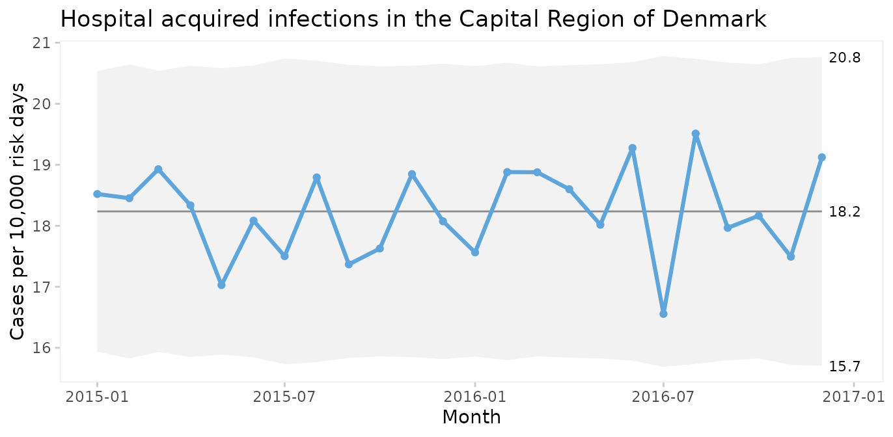

The infection rate appears predictable. However, plotting three types of
infection together is like mixing apples and oranges.

### Faceted U chart by type of infection

``` r
qic(month, n, days,
    data     = hospital_infections,
    facets   = ~ infection,
    chart    = 'u',
    multiply = 10000,
    title    = 'Hospital acquired infections in the Capital Region of Denmark',
    ylab     = 'Cases per 10,000 risk days',
    xlab     = 'Month')
```

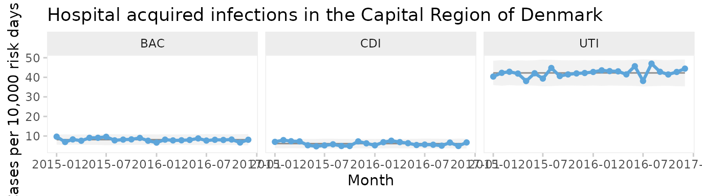

Now each infection has its own facet. We see that all three infections
appear to be predictable and that UTI is the most common infection.

But since these data come from six very different hospitals, we should
also facet by hospital.

### Two-way faceted U chart by infection and hospital

``` r
qic(month, n, days,
    data     = hospital_infections,
    facets   = infection ~ hospital,
    chart    = 'u',
    multiply = 10000,
    scales   = 'free_y',
    x.angle  = 45,
    title    = 'Hospital acquired infections in the Capital Region of Denmark',
    ylab     = 'Cases per 10,000 risk days',
    xlab     = 'Month')
```


This plot makes it easy to display the differences between both
hospitals and types of infection. Non-random variation is present in UTI
rates of two hospitals (BOH, NOH).

Note the use of individual y axes to better visualise variation over
time and the rotated x axis labels to avoid overlapping labels.

### Funnels plot of infection rates by hospital

Processes containing only common cause variation over time may be
aggregated and compared across other units than time. When data have no
natural time order, i.e., when the x variable is categorical, the data
points are not connected by lines and runs analysis is not performed. To
produce a funnel plot of infections by hospital, we filter data from a
recent stable period and reorder the x variable by size.

``` r
hai_2016 <- hospital_infections %>% 
  filter(month    >= '2016-07-01') %>% 
  mutate(hospital = reorder(hospital, days))

qic(hospital, n, days,
    data            = hai_2016,
    facets          = ~ infection,
    ncol            = 1,
    scales          = 'free_y',
    chart           = 'u',
    multiply        = 10000,
    decimals        = 1,
    show.labels     = TRUE,
    title           = 'Hospital acquired bacteremia 2016 (U funnel chart)',
    ylab            = 'Cases per 10,000 risk days',
    xlab            = 'Hospital')
```


One hospital, NOH, has unusually few bacteremias and urinary tract
infections compared to the other hospitals. Another hospital, BFH, has
unusually many *Clostridium difficile* infections. The other hospitals
are indistinguishable from each other with respect to the hospital
infection rates.

What can we learn from NOH and BFH? It is important to stress that data
presented in funnel plots should be used for learning rather than for
judgement. While it may be interesting for some in need of a “case” to
point fingers at the good, the bad, and the ugly, the full power of SPC
will only be released when data are used for learning and improvement.

## Case 5: Prime charts for count data with very large sample sizes

P and U charts with very large sample sizes sometimes produce narrow
3-sigma limits with most of the data points outside the limits even when
the process is stable.

The `nhs_accidents` dataset contains the number of emergency patients
seen within 4 hours of attendance. The sample sizes are very large (\>
250,000). See [`?nhs_accidents`](../reference/nhs_accidents.md) for
details.

``` r
head(nhs_accidents)
#>   i      r      n
#> 1 1 266501 280443
#> 2 2 264225 276823
#> 3 3 276532 291681
#> 4 4 281461 296155
#> 5 5 269071 282343
#> 6 6 261215 275888
```

When plotted on a P chart, the 3-sigma limits appear too narrow.

``` r
qic(i, r, 
    n        = n, 
    data     = nhs_accidents, 
    chart    = 'p',
    decimals = 3,
    title    = 'Proportion of patients seen within 4 hours of attendance (P chart)',
    ylab     = NULL,
    xlab     = 'Week #')
```


This is called over-dispersion, and happens sometimes because data in
practice rarely come from truly binomial or poisson distributions. When
the sample sizes are small, this is not a problem. But as sample sizes
increase (\> 1000) it becomes apparent that the assumptions of constant
proportions or rates between subgroups are not true.

A simple test for over-dispersion is to apply an I chart. If the I chart
gives 3-sigma limits that are very different from the U or P chart, it
is a signal that the underlying probability model of the U or P chart
may not be correct.

``` r
qic(i, r, 
    n        = n, 
    data     = nhs_accidents, 
    chart    = 'i',
    decimals = 3,
    title    = 'Proportion of patients seen within 4 hours of attendance (I chart)',
    ylab     = NULL,
    xlab     = 'Week #')
```

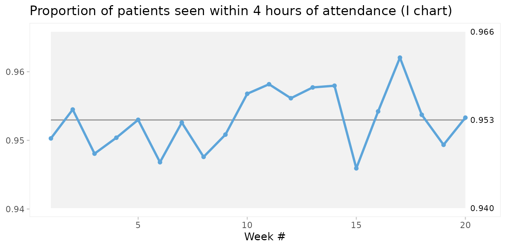

In fact, since the I chart estimates 3-sigma limits based on the
observed within subgroup variation in data rather than an assumed
probability model, it is sort of like the Swiss army knife of SPC.
Therefore, the I chart may be used when the true probability model of
data is unknown.

However, the I chart does not account for varying sample sizes and may
give false signals when sample sizes vary significantly. Laney proposed
an elegant solution that incorporates both within and between subgroup
variation in the calculation of 3-sigma limits. This is what P’ (P
prime) and U’ (U prime) charts are for. See Laney 2002 for details.

``` r
qic(i, r, 
    n        = n, 
    data     = nhs_accidents, 
    chart    = 'pp',
    decimals = 3,
    title    = 'Proportion of patients seen within 4 hours of attendance (P\' chart)',
    ylab     = NULL,
    xlab     = 'Week #')
```


Laney notes that when over-dispersion is not present, prime charts will
give the same results as traditional charts, and recommends always to
use prime charts for proportions and rates.

Comparing P and P’ charts on readmission rates from the `cabg` dataset
we find that while the 3-sigma limits in the P’ chart are a little
wider, the two charts reach similar conclusions.

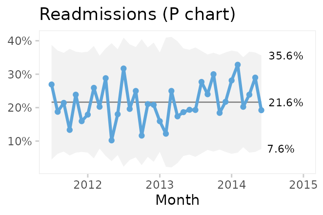

## Conclusion

[`qic()`](../reference/qic.md) from `qicharts2` provides a simple
interface for constructing statistical process control charts for time
series data.

The default chart is a run chart, which tests for non-random variation
in data over time using the Anhøj rules for unusually long runs and
unusually few crossings. The Anhøj rules are most useful for detection
of moderate, persistent shifts. To detect larger, possibly transient,
shifts, control charts are useful. [`qic()`](../reference/qic.md)
employs 11 types of control charts for different types of data.

Since runs analysis based on the Anhøj rules makes no assumptions about
the distribution of data, a run chart is the recommended starting point
of any analysis of time series data. If the run chart finds random
variation only, a control chart may then be used to identify transient
shifts in data or to establish the natural process limits to be expected
in the future.

## References

1.  Donald J. Wheeler (2000). [Understanding Variation – The Key to
    Managing
    Chaos](https://www.spcpress.com/book_understanding_variation.php),
    second edition. SPC Press.

2.  Jacob Anhøj, Anne Vingaard Olesen (2014). [Run Charts Revisited: A
    Simulation Study of Run Chart Rules for Detection of Non-Random
    Variation in Health Care
    Processes](https://journals.plos.org/plosone/article?id=10.1371/journal.pone.0113825).
    PLoS ONE 9(11): e113825.

3.  Jacob Anhøj (2015). [Diagnostic Value of Run Chart Analysis: Using
    Likelihood Ratios to Compare Run Chart Rules on Simulated Data
    Series](https://journals.plos.org/plosone/article?id=10.1371/journal.pone.0121349).
    PLoS ONE 10(3): e0121349.

4.  Donald J. Wheeler (2010). [Understanding Statistical Process
    Control](https://www.spcpress.com/book_understanding_statistical_process_control.php),
    third edition. SPC Press.

5.  Douglas C. Montgomery (2009). [Statistical Quality Control – A
    Modern
    Introduction](https://www.wiley.com/en-dk/Introduction+to+Statistical+Quality+Control%2C+8th+Edition-p-9781119723097),
    sixth edition. John Wiley & Sons.

6.  Lloyd S. Nelson (1982). [Control Charts for Individual
    Measurements](https://doi.org/10.1080/00224065.1982.11978811).
    Journal of Quality Technology 14(3), 172-173.

7.  David B. Laney (2002). [Improved control charts for
    attributes](https://doi.org/10.1081/QEN-120003555). Quality
    Engineering, 14(4), 531-537.

------------------------------------------------------------------------

## Appendix 1: Calculating 3-sigma limits

The functions for calculating 3-sigma limits with `qicharts2` are based
on the formulas provided by Montgomery (Montgomery 2009). Laney’s
correction factor for prime charts is from Laney 2002.

The general model for a control charts is

$$\bar{\bar{x}} \pm 3SD$$

where $\bar{\bar{x}}$ is the weighted average of the sample statistic
and $SD$ is the weighted sample standard deviation.

The procedure for calculating $SD$ depends on the type type of data
involved:

**I**: $\bar{x} \pm 2.66\overline{MR}$, $\bar{x} =$, sample average,
$\overline{MR} =$ average moving range of successive observations.

**MR**: $3.267\overline{MR}$, $\overline{MR} =$ average moving range (no
lower 3-sigma limit).

**Xbar**: $\bar{\bar{x}} \pm A_{3}\bar{s}$, $A_{3} =$ constant depending
on the sample size, $\bar{s} =$ weighted sample standard deviation.

**S**: $CL = \bar{s},LCL = B_{3}\bar{s},UCL = B_{4}\bar{s}$, $\bar{s} =$
weighted sample standard deviation, $B_{3}$ and $B_{4} =$ constants
depending on the sample size.

**C**: $\bar{c} \pm 3\sqrt{\bar{c}}$, $\bar{c} =$ average number of
defects.

**U**: $\bar{u} \pm 3\sqrt{\frac{\bar{u}}{n_{i}}}$, $\bar{u} =$ average
number of defects per unit, $n_{i} =$ size of inspection unit.

**P**:
$\bar{p} \pm 3\sqrt{\frac{\bar{p}\left( 1 - \bar{p} \right)}{n_{i}}}$,
$\bar{p} =$ average number of defectives, $n_{i} =$ sample size.

**G**: $\bar{x} \pm 3\sqrt{\bar{x}\left( \bar{x} + 1 \right)}$,
$\bar{x} =$ average number of opportunities between events.

**Notes**

1.  I charts use the correction suggested by Nelson by excluding moving
    ranges above the upper range limit from calculations of the 3-sigma
    limits (Nelson 1982).

2.  Runs analysis are not performed on MR charts since individual data
    points are correlated.

3.  3-sigma limits for the T chart for time between rare events are
    calculated by applying an I chart to transformed data
    ($y = y^{1/3.6}$) and back transforming the 3-sigma limits
    ($cl = cl^{3.6}$).

4.  In prime charts, the calculated standard deviation is multiplied by
    Laney’s correction factor, which is the average moving range of
    standardised y values divided by the constant 1.128 (Laney 2002).

5.  Since the count data on a G chart are usually highly skewed, the
    centre line of the G chart is the median rather than the mean. This
    way the application of the Anhøj rules is still valid.

## Appendix 2: Critical values for longest run and number of crossings

``` r
n <- 10:100
x <- data.frame(
  `Number of useful observations`       = n,
  `Upper limit for longest run`         = round(log2(n) + 3),
  `Lower limit for number of crossings` = qbinom(0.05, n - 1, 0.5),
  check.names                           = FALSE)

knitr::kable(x)
```

| Number of useful observations | Upper limit for longest run | Lower limit for number of crossings |
|------------------------------:|----------------------------:|------------------------------------:|
|                            10 |                           6 |                                   2 |
|                            11 |                           6 |                                   2 |
|                            12 |                           7 |                                   3 |
|                            13 |                           7 |                                   3 |
|                            14 |                           7 |                                   4 |
|                            15 |                           7 |                                   4 |
|                            16 |                           7 |                                   4 |
|                            17 |                           7 |                                   5 |
|                            18 |                           7 |                                   5 |
|                            19 |                           7 |                                   6 |
|                            20 |                           7 |                                   6 |
|                            21 |                           7 |                                   6 |
|                            22 |                           7 |                                   7 |
|                            23 |                           8 |                                   7 |
|                            24 |                           8 |                                   8 |
|                            25 |                           8 |                                   8 |
|                            26 |                           8 |                                   8 |
|                            27 |                           8 |                                   9 |
|                            28 |                           8 |                                   9 |
|                            29 |                           8 |                                  10 |
|                            30 |                           8 |                                  10 |
|                            31 |                           8 |                                  11 |
|                            32 |                           8 |                                  11 |
|                            33 |                           8 |                                  11 |
|                            34 |                           8 |                                  12 |
|                            35 |                           8 |                                  12 |
|                            36 |                           8 |                                  13 |
|                            37 |                           8 |                                  13 |
|                            38 |                           8 |                                  14 |
|                            39 |                           8 |                                  14 |
|                            40 |                           8 |                                  14 |
|                            41 |                           8 |                                  15 |
|                            42 |                           8 |                                  15 |
|                            43 |                           8 |                                  16 |
|                            44 |                           8 |                                  16 |
|                            45 |                           8 |                                  17 |
|                            46 |                           9 |                                  17 |
|                            47 |                           9 |                                  17 |
|                            48 |                           9 |                                  18 |
|                            49 |                           9 |                                  18 |
|                            50 |                           9 |                                  19 |
|                            51 |                           9 |                                  19 |
|                            52 |                           9 |                                  20 |
|                            53 |                           9 |                                  20 |
|                            54 |                           9 |                                  21 |
|                            55 |                           9 |                                  21 |
|                            56 |                           9 |                                  21 |
|                            57 |                           9 |                                  22 |
|                            58 |                           9 |                                  22 |
|                            59 |                           9 |                                  23 |
|                            60 |                           9 |                                  23 |
|                            61 |                           9 |                                  24 |
|                            62 |                           9 |                                  24 |
|                            63 |                           9 |                                  25 |
|                            64 |                           9 |                                  25 |
|                            65 |                           9 |                                  25 |
|                            66 |                           9 |                                  26 |
|                            67 |                           9 |                                  26 |
|                            68 |                           9 |                                  27 |
|                            69 |                           9 |                                  27 |
|                            70 |                           9 |                                  28 |
|                            71 |                           9 |                                  28 |
|                            72 |                           9 |                                  29 |
|                            73 |                           9 |                                  29 |
|                            74 |                           9 |                                  29 |
|                            75 |                           9 |                                  30 |
|                            76 |                           9 |                                  30 |
|                            77 |                           9 |                                  31 |
|                            78 |                           9 |                                  31 |
|                            79 |                           9 |                                  32 |
|                            80 |                           9 |                                  32 |
|                            81 |                           9 |                                  33 |
|                            82 |                           9 |                                  33 |
|                            83 |                           9 |                                  34 |
|                            84 |                           9 |                                  34 |
|                            85 |                           9 |                                  34 |
|                            86 |                           9 |                                  35 |
|                            87 |                           9 |                                  35 |
|                            88 |                           9 |                                  36 |
|                            89 |                           9 |                                  36 |
|                            90 |                           9 |                                  37 |
|                            91 |                          10 |                                  37 |
|                            92 |                          10 |                                  38 |
|                            93 |                          10 |                                  38 |
|                            94 |                          10 |                                  39 |
|                            95 |                          10 |                                  39 |
|                            96 |                          10 |                                  39 |
|                            97 |                          10 |                                  40 |
|                            98 |                          10 |                                  40 |
|                            99 |                          10 |                                  41 |
|                           100 |                          10 |                                  41 |
